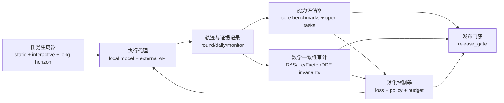

# 面向鲁棒自演化 AGI 的实现蓝图（结合现有 H2Q-Evo）

目标：在现有工程基础上，构建“可长期运行、可持续自我改进、可被公开基准验证”的 AGI 系统演进路径。

## 1) 与公开研究方向对齐（面向实现）

以下对齐基于公开信息与当前仓库能力边界：

- AGI 分级与可操作化评估
: 参考 `Levels of AGI for Operationalizing Progress on the Path to AGI`（arXiv:2311.02462, v5 2025）。重点是把“能力深度 + 广度 + 自主性”转成阶段性指标。

- 开放式通用推理评估
: ARC Prize 公开方向已覆盖 ARC-AGI-1/2/3，其中 ARC-AGI-3 引入交互式环境，要求探索、目标保持、记忆与策略修正。

- 长时程代理能力与风险评估
: METR 方向强调“可完成任务时长(time horizon)”与“自主能力风险评估”。该维度适合补齐本仓现有短回合测试。

- 实用工程能力外显
: SWE-bench 体系强调真实代码库问题闭环（定位-修改-测试-回归）。可作为工程智能强信号之一。

结论
- 你当前系统已经具备“演化 + 监控 + 门禁”主骨架，下一步关键是把评测空间从“静态任务集”扩展到“交互、长时程、跨域迁移”，并将数学创新模块映射为可验证收益。

## 2) 当前系统到 AGI 的同构映射

将现有数学创新与系统能力做同构映射：

1. DAS 三公理 <-> 世界模型结构先验
- 用于定义可扩展表征空间和约束不变量，避免能力增长中的结构崩塌。

2. 李群自同构/DDE <-> 策略变换不变性
- 用于处理“同任务不同表述”的策略一致性，降低任务表面变化导致的性能退化。

3. Fueter 非交换微分 <-> 高维状态更新稳定性
- 用于约束复杂状态变换中的局部一致性，抑制演化振荡。

4. 演化损失系统 <-> 自我改进控制器
- 把能力增益、知识融合、涌现与稳定性统一到单轮可回传信号，驱动下一轮控制参数自适应。

## 3) 目标架构（在现有代码上最小增量）



## 4) 分阶段落地方案

### 阶段 A（1-2 周）：把“可跑”升级为“可控”

1. 建立能力注册表（Capability Registry）
- 新增：`tools/capability_registry.py`
- 内容：能力维度、任务族、难度、置信区间、最近趋势、退化告警。

2. 扩展 release_gate 为多维硬门槛
- 在现有 `tools/release_gate.py` 增加：
  - 长时程任务最小时长门槛
  - 跨域迁移成功率门槛
  - 外助依赖上限（避免“只靠外助过门禁”）

3. 引入回滚策略模板
- 新增：`tools/evolution_rollback_policy.py`
- 条件：连续 N 轮关键指标下滑时，自动回退到上个稳定配置。

### 阶段 B（2-4 周）：把“可控”升级为“可泛化”

1. 增加交互式开放任务评测
- 新增：`benchmarks/interactive_reasoning/`。
- 最小版本：迷宫探索、工具调用规划、记忆依赖任务。
- 指标：目标达成率、样本效率、探索-利用平衡。

2. 增加长时程代理评测
- 新增：`benchmarks/long_horizon/`。
- 指标：time-horizon@50%、time-horizon@80%。

3. 增加工程闭环评测
- 新增：`benchmarks/engineering_loop/`。
- 指标：issue 解决率、回归通过率、平均修复时延。

### 阶段 C（4-8 周）：把“可泛化”升级为“可验收”

1. 公开基准对齐报告自动化
- 新增：`tools/public_alignment_report.py`
- 输出：与 ARC-AGI/SWE-bench/长时程评测维度的映射矩阵与差距解释。

2. 数学模块收益归因
- 新增：`tools/math_ablation_runner.py`
- 做法：关闭/替换某个数学模块后比较能力变化，形成因果证据。

3. 多模型 API 协同策略
- 在现有外助框架扩展为 provider 池：主模型 + 校验模型 + 反事实模型。
- 目标：降低单一 API 漂移风险，提升鲁棒性。

## 5) 公开可公认 AGI 验收建议（本仓可执行版）

定义“公开可公认验收”四大维度（每个维度必须有机器可复核证据）：

1. 广度（Breadth）
- 至少覆盖：推理、工程、科学任务、交互任务、长期规划。

2. 深度（Depth）
- 每个任务族有分级难度曲线，不是单点通过。

3. 自主性（Autonomy）
- 在预算和安全约束下，能自主完成多步任务并恢复失败流程。

4. 鲁棒性（Robustness）
- 对输入扰动、域迁移、外助抖动、资源波动保持稳定下界。

门禁模板（建议）
- `gate_ok = trust_ok && acceptance_ok && docker_ok && monitor_ok && assist_gate_ok && breadth_ok && horizon_ok && robustness_ok`

## 6) 对当前仓库的优先改造清单（按投入产出比）

1. `tools/release_gate.py`
- 增加 `breadth/horizon/robustness` 信号汇总字段与硬阈值。

2. `tools/agi_self_evolution_daemon.py`
- 增加“外助成功但本地失败”分离统计，避免外助掩盖本体能力退化。

3. `tools/agi_realtime_monitor.py`
- 增加“跨域迁移失败率”和“长时程中断率”时间窗指标。

4. `tools/unified_system_framework.py`
- 增加“数学一致性收益归因”子评分。

## 7) 最小执行建议（今天即可开始）

1. 先把阶段 A 做完并进入 CI 硬门禁。
2. 一周内落地一个交互式 benchmark（哪怕先做 20-50 题）。
3. 用 `math_ablation_runner` 验证数学创新模块的可量化收益。
4. 每日自动产出公开对齐报告，避免“只在内部指标自洽”。

## 8) 动态蓝图自举系统（已实现）

新增脚本：`tools/dynamic_blueprint_bootstrap.py`

能力
- 自动读取最新证据：`release_gate/capability_registry/public_alignment/interactive_benchmark/nightly_regression_guard`。
- 动态生成“模块蓝图队列”：根据 breadth/horizon/robustness/alignment/interactive gap 自动排序优先级。
- 执行蓝图并回写状态：每轮执行后更新 `reports/dynamic_blueprint_state_latest.json`，用于下一轮优先级自调。
- 产出机器可审计报告：`reports/dynamic_blueprint_bootstrap_latest.json/.md`。

新增升级能力（v2）
- 自动模块骨架生成：根据 gap 自动生成候选实现到 `tools/generated_blueprints/*.py`，并在同轮执行验证。
- release_gate 强循环模式：每轮可包含完整门禁评估，失败后触发恢复步骤并重试（`--strong-release-gate-cycle`）。
- 跨轮策略学习：依据历史回归模式自动调整目标阈值与动作上限（`interactive_target/alignment_target/warn_drop/fail_drop/max_actions_per_cycle`）。

默认蓝图模块
- `interactive_bfs`（稳定基线）
- `capability_registry`
- `math_ablation`
- `public_alignment`
- `regression_guard`

可选蓝图模块
- `interactive_model_probe`（`--allow-model-solver`）
- `release_gate`（`--enable-release-gate-cycle`）

示例

```bash
PYTHONPATH=. python3 tools/dynamic_blueprint_bootstrap.py \
  --cycles 1 \
  --max-actions-per-cycle 4 \
  --interactive-target 0.85 \
  --alignment-target 0.80 \
  --enable-module-synthesis \
  --enable-release-gate-cycle \
  --strong-release-gate-cycle \
  --release-gate-retries 2
```

说明
- 该系统是“自举优化编排器”，目标是持续提高可执行能力与可审计性，不是 AGI 达成声明。

---

备注
- 本文不是“AGI 已实现”的断言，而是将你现有系统推进到“可持续迭代 + 可公开审计 + 可复现验收”的工程路线。
- 真正通过公认 AGI 验收，关键不在单次高分，而在跨任务、跨周期、跨扰动条件下稳定复现。
