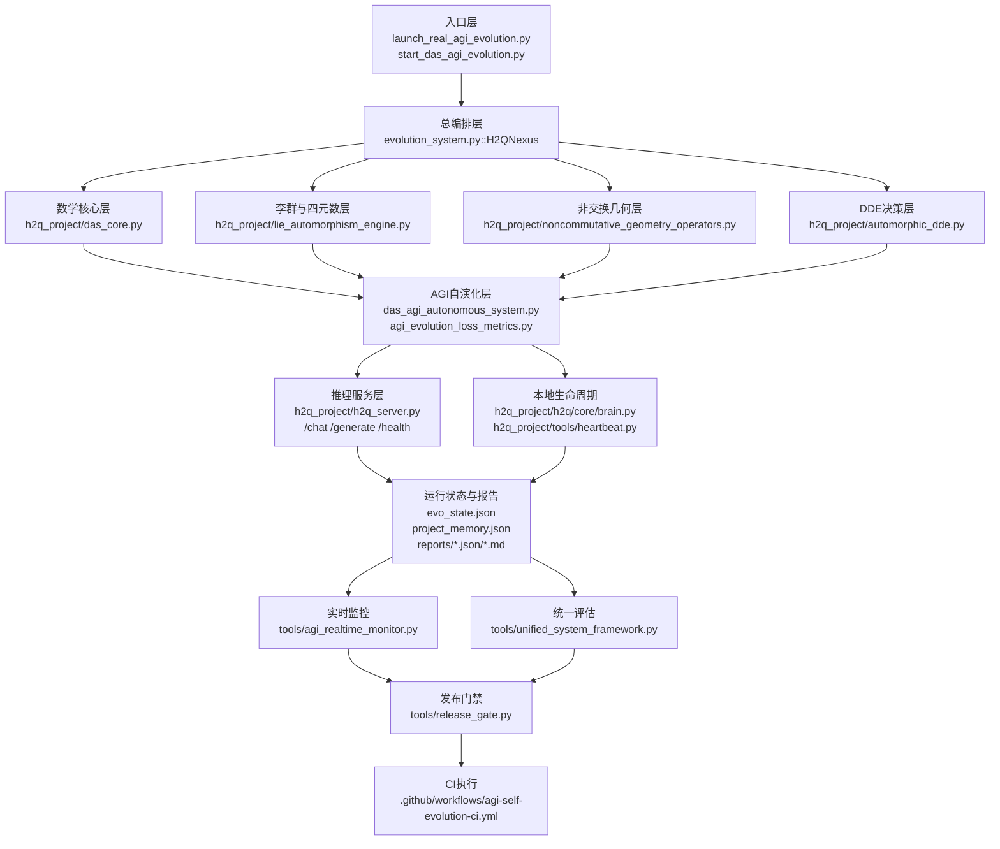

# H2Q-Evo 系统级联导图（2026-03）

本导图基于仓库当前实现扫描生成，重点覆盖：调度层、数学核心层、推理服务层、自演化层、监控与验收门禁层。

- 接口索引工件：`reports/h2q_interface_registry_latest.txt`
- 生成方式：`project_graph.generate_interface_map("./h2q_project")`
- 当前符号索引规模：`1640`

## 1) 系统级联总图



## 2) 关键路径（从请求到验收）

1. 用户请求进入 `h2q_project/h2q_server.py`。
2. 服务端根据模式触发 DAS/本地推理，并记录运行态指标。
3. 自演化守护进程 `tools/agi_self_evolution_daemon.py` 运行一轮或多轮，产出 round/daily 报告。
4. 监控器 `tools/agi_realtime_monitor.py` 汇总窗口统计，形成诊断快照。
5. `tools/unified_system_framework.py` 聚合系统健壮性与一致性信号。
6. `tools/release_gate.py` 汇总 trusted center + daemon + monitor + framework，给出机器判定 `gate_ok`。
7. CI 工作流强制执行门禁并上传证据工件。

## 3) 与数学创新的映射关系

- DAS 三公理（生成、正交扩展、度量不变）
: 负责结构归纳与约束边界，位于 `h2q_project/das_core.py`。
- 四元数李群与自同构
: 负责表示空间变换与不变量，位于 `h2q_project/lie_automorphism_engine.py` 与 `h2q_project/automorphic_dde.py`。
- Fueter 非交换几何微分
: 负责高维几何微分一致性，位于 `h2q_project/noncommutative_geometry_operators.py`。
- 演化损失系统
: 将能力提升、知识融合、涌现与稳定性转成可优化信号，位于 `agi_evolution_loss_metrics.py`。

## 4) 现态优势与瓶颈

优势
- 已具备“可执行门禁”链路：`release_gate` + CI。
- 已接入“外助能力”强制验收（DeepSeek 可选强制）。
- 已形成 round/daily/monitor/framework 多视角证据体系。

瓶颈
- 多数能力验证仍偏任务型，不足以覆盖“开放环境通用智能”。
- 数学模块与在线推理闭环的端到端可解释度仍需加强。
- 长程记忆与跨周期自校正机制尚未形成统一协议层。

## 5) 建议新增的级联节点（不破坏现有结构）

1. `capability_registry` 节点
- 记录每类能力的任务族、难度曲线、可信度衰减。

2. `policy_runtime` 节点
- 对每轮自演化输出执行策略验证（安全、成本、回滚约束）。

3. `world_model_eval` 节点
- 加入交互式开放任务评估（非静态题库），补齐 ARC-AGI-3 类能力维度。

4. `proof_oracle` 节点
- 对数学不变量与关键约束做形式化/半形式化校验，避免“理论与实现漂移”。

## 6) 最小可执行扫描命令

```bash
/Users/imymm/H2Q-Evo/.venv/bin/python - <<'PY'
from project_graph import generate_interface_map
report, index = generate_interface_map('./h2q_project')
print('symbols=', len(index))
print(report[:2000])
PY
```
