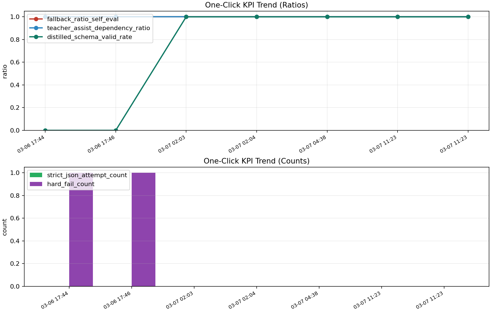

# One-Click KPI Dashboard

- generated_at_utc: `2026-03-07T11:23:41.869680+00:00`
- session: `/Users/imymm/H2Q-Evo/reports/trusted_local_agi_chat_session_1772821274.json`
- release_gate: `/Users/imymm/H2Q-Evo/reports/release_gate_latest.json`
- distillation_pipeline: `/Users/imymm/H2Q-Evo/reports/self_eval_distillation_pipeline_latest.json`
- distilled_benchmark: `/Users/imymm/H2Q-Evo/reports/self_model_consistency_distilled_latest.json`
- formal_assessment: `/Users/imymm/H2Q-Evo/reports/distill_evo_public_formal_assessment_latest.json`

## KPI Metrics
- strict_json_attempt_count: `0`
- hard_fail_count: `0`
- fallback_ratio_self_eval: `1.000000`
- teacher_assist_dependency_ratio: `1.000000`
- distilled_schema_valid_rate: `1.000000`
- distill_schema_valid_rate_delta: `+1.000000`
- distill_schema_valid_rate_positive: `True`

## Quick Visual
- fallback_ratio_self_eval
  `####################`
- teacher_assist_dependency_ratio
  `####################`
- distilled_schema_valid_rate
  `####################`

## Trend Chart

## Supporting Signals
- self_eval_total: `1`
- self_eval_fallback_count: `1`
- assist_provider: `deepseek`
- assist_enabled: `True`
- assist_calls: `6`
- assist_success_calls: `6`
- distill_baseline_schema_valid_rate: `0.000000`
- distill_total_runs: `150`
- distill_adapter_enabled: `True`

## Distillation Robustness (30 vs 50)
- available_sessions: `[30, 50]`
- sessions=30, total_runs=90, schema_valid_rate=1.000000, overall_score=0.913782
- sessions=50, total_runs=150, schema_valid_rate=1.000000, overall_score=0.913007
- delta_schema_valid_rate: `+0.000000`
- delta_overall_score: `-0.000775`

## Formal Assessment Summary
- available: `True`
- generated_at_utc: `2026-03-07T04:49:38.083998+00:00`
- lean_compile_success: `True`
- facts: `{'distill_pipeline_all_steps_ok': True, 'public_validation_all_steps_ok': True, 'distilled_schema_positive': True, 'baseline_gate_ok': True, 'longrun_gate_ok': True}`
- distill sessions=50, schema_valid_rate=1.000000, overall_score=0.913007, delta_schema_valid_rate=+1.000000
- public baseline_gate_ok=True, longrun_gate_ok=True, baseline_alignment=0.999817, longrun_alignment=0.956983
